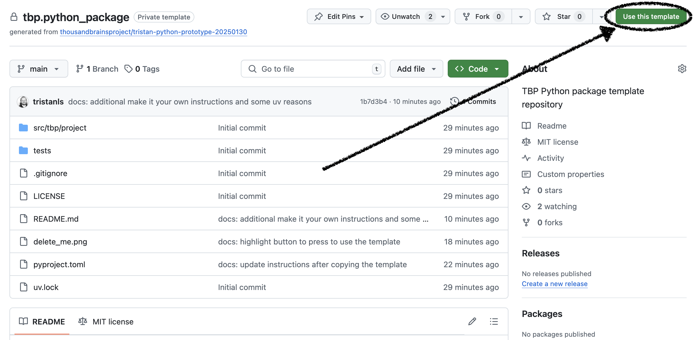

# Python package template

This is a Python package template. For use-cases that require packaging and distribution, this template is suitable.

For a Python application template, see https://github.com/thousandbrainsproject/tbp.python_application
For a Python library template, see https://github.com/thousandbrainsproject/tbp.python_library

To create a repository from this template, find and click the "Use this template" button:



## Make it yours

After copying the template, you need to address the following TODOs.

### `pyproject.toml`

- Update the project `description`
- Update the project `name`
- Confirm desired Python version in `requires-python`
- Update the `Repository` and `Issues` URLs

### `delete_me.png`

- Delete this file

### `README.md`

- Update for your project

## Development

The development of this project is managed with [uv](https://docs.astral.sh/uv/), "a single tool to replace `pip`, `pip-tools`, `pipx`, `poetry`, `pyenv`, `twine`, `virtualenv`, and more." You will need to install it.

We use `uv` as it tracks the latest PEP standards while relying on existing infrastructure like `pip`, `venv`, etc.

`uv.lock` is non-standard in Python, but as Python does not yet define a lockfile standard, any lockfile format is non-standard. The benefit of `uv.lock` is that it is cross-platform and "captures the packages that would be installed across all possible Python markers such as operating system, architecture, and Python version". This makes it safe to check-in to the repository.

### Install `uv`

On a Mac, `brew install uv` is sufficient. For additional options, see the [uv installation instructions](https://docs.astral.sh/uv/getting-started/installation/).

### Install dependencies

```bash
uv sync
```

### Run formatter

```bash
uv run ruff format
```

### Run style checks

```bash
uv run ruff check
```

### Run dependency checks

```bash
uv run deptry src tests
```

### Run static type checks

```bash
uv run mypy
```

### Run tests

```bash
uv run pytest
```

### Build package

```bash
uv build
```